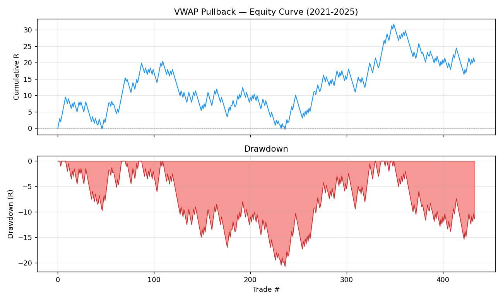

# VWAP Pullback — Raport badawczy v1

**Strategia:** VWAP Pullback (LONG only)  
**Symbol:** USATECHIDXUSD (US100 CFD, bary 5-minutowe)  
**Okres:** 2021-01-01 – 2025-12-31  
**Wygenerowano:** 2026-03-13  

---

## 1. Koncepcja strategii

VWAP Pullback zakłada, że rynek w trendzie wzrostowym (cena powyżej EMA) będzie
powracał do VWAP jako dynamicznego poziomu wsparcia, po czym wznowi ruch w górę.
Wejście następuje po potwierdzeniu byczej świecy przy pullbacku do VWAP.

### Logika wejścia (LONG only)

```
1. Filtr trendu    : close_bid > EMA50 (na barach 1h, forward-fill do 5m)
2. Reżim byczý     : ostatnie 3 bary zamknięte powyżej VWAP
3. Pullback        : low_bid <= VWAP + 0.5 × ATR  (cena dotknęła okolicy VWAP)
4. Potwierdzenie   : świeca bycza (close > open), close > VWAP, body_ratio >= 0.10
5. Wejście         : otwarcie następnej świecy 5m
6. Stop Loss       : low pullback_bara - 0.3 × ATR
7. Take Profit     : entry + 1.5 × ryzyko
8. Zamknięcie EOD  : 21:00 UTC (jeśli ani SL, ani TP nie trafiony)
```

### Parametry

| Parametr | Wartość | Opis |
|----------|---------|------|
| `ema_period_htf` | 50 | EMA na barach 1h |
| `vwap_tolerance_atr_mult` | 0.5 | Tolerancja pullbacku: low <= VWAP + N×ATR |
| `min_bars_above_vwap` | 3 | Wymagana liczba barów reżimu byczego |
| `min_body_ratio` | 0.10 | Min. udział body świecy potwierdzającej |
| `stop_buffer_atr_mult` | 0.30 | Bufor SL poniżej low pullbacku |
| `take_profit_rr` | 1.5 | Risk/Reward TP |
| `session_start_hour_utc` | 14 | Sesja US od 14:00 UTC |
| `session_end_hour_utc` | 21 | Zamknięcie EOD o 21:00 UTC |
| `max_trades_per_day` | 1 | Maksymalnie 1 transakcja dziennie |
| `atr_period` | 14 | Okres ATR (Wilder EWM) |

### Uwaga: VWAP bez danych volumenowych

Dla CFD USATECHIDXUSD nie są dostępne dane tickowe ani volumenowe.
VWAP obliczany jest jako równoważona kumulatywna średnia typical price:

```
TP[i]   = (high_bid + low_bid + close_bid) / 3
VWAP[i] = mean(TP[0..i])  w obrębie każdego dnia kalendarzowego (UTC)
```

Kotwica VWAP resetuje się o północy UTC — do momentu wejścia (ok. 14:30 UTC)
VWAP zdążył już wchłonąć ~14,5h danych. To istotna różnica wobec klasycznego
session-VWAP (kotwica przy otwarciu sesji), co jest jedną z przesłanek słabości
wersji v1.

---

## 2. Wyniki — pełny okres 2021–2025

### Metryki zbiorcze

| Metryka | Wartość | Próg "dobry" | Ocena |
|---------|---------|--------------|-------|
| Liczba transakcji | 433 | — | — |
| Transakcje / rok | 86.6 | ≥ 60 | ✅ |
| Win rate | 43.0% | — | — |
| **Expectancy (R)** | **+0.047** | **≥ +0.10** | **❌** |
| **Profit factor** | **1.08** | **≥ 1.20** | **❌** |
| Max drawdown | 20.8 R | < 15 R | ❌ |
| Max consec. losses | 8 | — | — |
| Wyjścia TP / SL / EOD | 40% / 56% / 4% | — | — |

Dni z setupem: **433** z 1821 dni tradingowych (24% aktywności)  
Dni bez setupu: **1388**

### Rozkład wyjść

Dominują wyjścia przez SL (56%) — strategia częściej traci niż TP. Niski udział
EOD (4%) świadczy, że większość transakcji rozstrzyga się w trakcie sesji.

---

## 3. Wyniki roczne

| Rok | Trades | WR% | E(R) | PF | Trend rynku | Ocena |
|-----|--------|-----|------|----|-------------|-------|
| 2021 | 89 | 49.4% | +0.201 | 1.41 | Trend wzrostowy | ✅ |
| 2022 | 66 | 34.8% | −0.129 | 0.80 | Rynek niedźwiedzi | ❌ |
| 2023 | 93 | 41.9% | −0.003 | 0.99 | Konsolidacja/odbudowa | ⚠️ |
| 2024 | 95 | 49.5% | +0.197 | 1.39 | Silny trend wzrostowy | ✅ |
| 2025 | 90 | 36.7% | −0.082 | 0.87 | Zmienność/korekty | ❌ |

**Obserwacja:** wyniki dobre w latach silnego trendu wzrostowego (2021, 2024),
słabe w rynkach niedźwiedzich i konsolidacyjnych. Strategia działa jak beta
na kierunek rynku — brak strukturalnej krawędzi niezależnej od reżimu.

---

## 4. Wykres equity



Krzywa equity wykazuje naprzemienną strukturę zysk/strata powiązaną z reżimem
rynkowym — brak stabilnego, monotonicznych wzrostu charakterystycznego dla
strategii z prawdziwą krawędzią.

---

## 5. Diagnoza słabości v1

### 5.1 VWAP zakotwiczony w złym punkcie

Klasyczna zastosowanie: VWAP sesyjny zakotwiczony przy otwarciu sesji (14:30 UTC).  
Wersja v1: VWAP zakotwiczony o północy, akumuluje 14,5h danych zanim sesja US się
zacznie — poziom ten nie odzwierciedla równowagi cenowej bieżącej sesji.

**Konsekwencja:** sygnały pullback do "stale VWAP" mają mniejszy sens fundamentalny.

### 5.2 Za szeroka tolerancja pullbacku

`vwap_tolerance_atr_mult = 0.5` oznacza, że cena może być 0.5×ATR **powyżej** VWAP
i nadal liczyć się jako pullback. Przy ATR=15 pkt, cena może być 7.5 pkt nad VWAP —
to nie jest dotknięcie VWAP, to swobodna strefa.

**Konsekwencja:** strategia wchodzi w zbyt wiele barów, które nie są prawdziwymi
pullbackami — rozcieńcza to sygnał.

### 5.3 Brak danych volumenowych

Prawdziwy VWAP ważony wolumenem jest silnym poziomem instytucjonalnym. Equal-weight
TP-VWAP jest jego słabym przybliżeniem — może nie przekładać się na faktyczne zachowanie
market makers wokół tego poziomu.

---

## 6. Wnioski

> **Strategia nie wykazuje przekonującej krawędzi w obecnej konfiguracji.**

- E(R) = +0.047 R (próg: ≥ +0.10) — **FAIL**
- PF = 1.08 (próg: ≥ 1.20) — **FAIL**
- MaxDD = 20.8 R (próg: < 15 R) — **FAIL**
- Wyniki roczne niestabilne: silna zależność od reżimu rynkowego

Koncepcja VWAP Pullback jest uzasadniona analitycznie, ale wymaga poprawy
implementacji przed dalszą walidacją.

---

## 7. Proponowane eksperymenty v2

Priorytetowo:

| # | Eksperyment | Hipoteza | Złożoność |
|---|-------------|----------|-----------|
| 1 | **VWAP z kotwicą sesyjną** (reset 14:30 UTC) | Lepsza trafność poziomu | Niska |
| 2 | **Wymóg low_bid ≤ VWAP** (zamiast ≤ VWAP + 0.5×ATR) | Tylko prawdziwe dotknięcia | Niska |
| 3 | **Filtr zmienności** (ATR > mediana 20-dniowa) | Odfiltrowanie dni konsolidacji | Średnia |
| 4 | **Filtr reżimu (trend tygodniowy)** | Wejście tylko w bull market | Średnia |
| 5 | **Grid search v2** po poprawce kotwicy i tolerancji | Znalezienie stabilnego parametru | Wysoka |

---

## 8. Pliki

| Plik | Opis |
|------|------|
| `strategies/VWAPPullback/config.py` | Dataclass konfiguracji |
| `strategies/VWAPPullback/strategy.py` | Logika: VWAP, backtest, metryki |
| `strategies/VWAPPullback/research/vwap_pullback_mini_test.py` | Skrypt mini-testu |
| `strategies/VWAPPullback/research/output/vwap_pullback_mini_test_trades.csv` | Lista 433 transakcji |
| `strategies/VWAPPullback/research/plots/vwap_pullback_equity.png` | Equity curve |
| `strategies/VWAPPullback/tests/test_vwap_pullback.py` | 9 testów jednostkowych (wszystkie PASS) |

---

*v1 — 2026-03-13 | Następna wersja: VWAPPullback v2 z kotwicą sesyjną*
