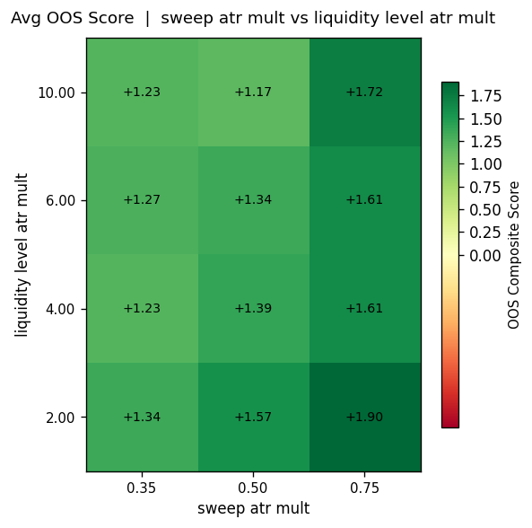
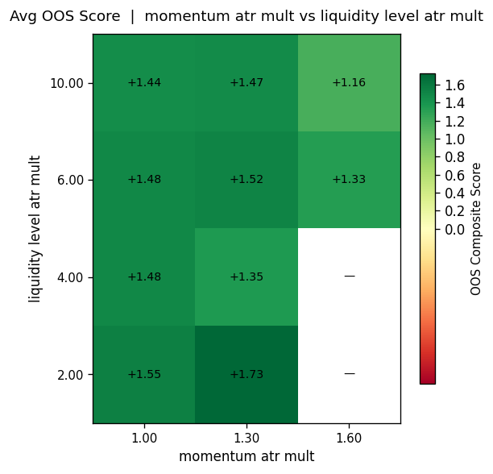
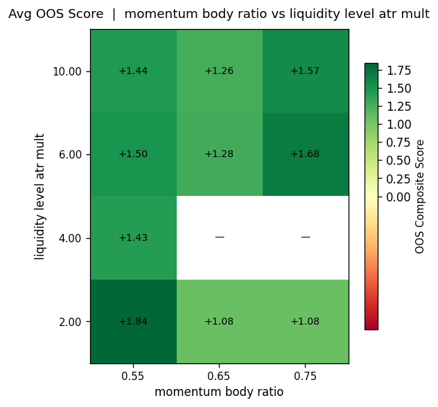
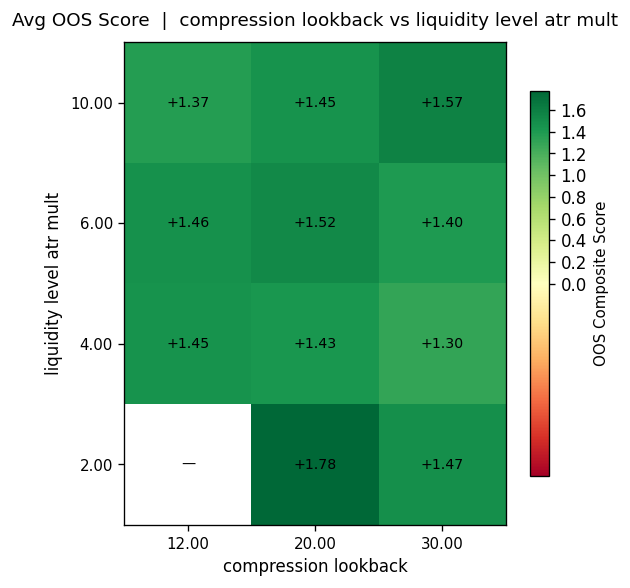

# VCLSMB Parameter Grid Search Report

**Generated:** 2026-03-12 08:38 UTC
**Strategy:** VolatilityContraction → LiquiditySweep → MomentumBreakout (VCLSMB)
**Trend Filter:** Disabled
**Volatility Regime Filter:** Disabled
**Liquidity Location Filter (PDH/PDL):** Enabled — sweep within [2.0, 4.0, 6.0, 10.0] × ATR of daily level

## Methodology

- **IS period (In-Sample):**  2021-01-01 – 2022-12-31  (2 years, model development)
- **OOS period (Out-of-Sample):** 2023-01-01 – 2025-12-31 (3 years, robustness validation)
- **Data:** 5-min bars, USATECHIDXUSD

### Parameter Grid

| Parameter | Values |
|-----------|--------|
| `sweep_atr_mult` | [0.35, 0.5, 0.75] |
| `momentum_atr_mult` | [1.0, 1.3, 1.6] |
| `momentum_body_ratio` | [0.55, 0.65, 0.75] |
| `compression_lookback` | [12, 20, 30] |
| `liquidity_level_atr_mult` | [2.0, 4.0, 6.0, 10.0] |
| `liquidity_level_atr_mult` | [2.0, 4.0, 6.0, 10.0] |

**Total combinations:** 324  (IS + OOS = 648 backtests)

### Composite Score Formula

```
score = 1.0 × profit_factor
      + 3.0 × expectancy_R
      - 0.5 × (max_dd_R / 10.0)
      + 0.5 × (min(trades, 100) / 100) ^ 0.75

Hard filters: trades ≥ 40, E(R) > 0, max_dd_R < 30
```

---

## Overall Results

- **Total combinations tested:** 324
- **Viable OOS (pass hard filters):** 90 (28%)
- **Best OOS score:** 2.718
  - `sweep_atr_mult` = 0.75
  - `momentum_atr_mult` = 1.30
  - `momentum_body_ratio` = 0.75
  - `compression_lookback` = 20
  - `liquidity_level_atr_mult` = 6.00
  - OOS E(R) = +0.364
  - OOS win rate = 45.5%
  - OOS profit factor = 1.67
  - OOS trades = 22
  - OOS max DD = 4.0R

---

## Top 15 Candidates (by OOS Composite Score)

| Rank | sweep | mom_atr | body | comp_lb | IS_E(R) | OOS_E(R) | IS_PF | OOS_PF | IS_n | OOS_n | OOS_DD | OOS_score |
|------|-------|---------|------|---------|---------|----------|-------|--------|------|-------|--------|-----------|
| 1 | 0.75 | 1.30 | 0.75 | 20 | +0.167 | +0.364 | 1.27 | 1.67 | 18 | 22 | 4.0 | 2.718 |
| 2 | 0.75 | 1.30 | 0.55 | 20 | +0.400 | +0.350 | 1.75 | 1.64 | 15 | 20 | 3.0 | 2.686 |
| 3 | 0.75 | 1.30 | 0.75 | 20 | +0.091 | +0.320 | 1.14 | 1.57 | 22 | 25 | 4.0 | 2.508 |
| 4 | 0.75 | 1.00 | 0.55 | 12 | -0.069 | +0.241 | 0.90 | 1.41 | 29 | 29 | 4.0 | 2.134 |
| 5 | 0.75 | 1.30 | 0.75 | 30 | -0.077 | +0.241 | 0.89 | 1.41 | 26 | 29 | 4.0 | 2.134 |
| 6 | 0.75 | 1.00 | 0.75 | 20 | +0.080 | +0.222 | 1.12 | 1.38 | 25 | 27 | 3.0 | 2.079 |
| 7 | 0.50 | 1.30 | 0.55 | 20 | +0.071 | +0.227 | 1.11 | 1.38 | 14 | 22 | 3.0 | 2.077 |
| 8 | 0.75 | 1.00 | 0.55 | 20 | +0.263 | +0.227 | 1.45 | 1.38 | 19 | 22 | 3.0 | 2.077 |
| 9 | 0.75 | 1.30 | 0.55 | 30 | +0.263 | +0.227 | 1.45 | 1.38 | 19 | 22 | 3.0 | 2.077 |
| 10 | 0.75 | 1.00 | 0.55 | 20 | -0.036 | +0.216 | 0.95 | 1.36 | 28 | 37 | 4.0 | 2.049 |
| 11 | 0.75 | 1.30 | 0.55 | 20 | +0.043 | +0.219 | 1.07 | 1.37 | 23 | 32 | 4.0 | 2.038 |
| 12 | 0.75 | 1.00 | 0.55 | 12 | +0.038 | +0.222 | 1.06 | 1.38 | 26 | 27 | 4.0 | 2.029 |
| 13 | 0.75 | 1.00 | 0.55 | 20 | -0.156 | +0.200 | 0.78 | 1.33 | 32 | 40 | 4.0 | 1.985 |
| 14 | 0.75 | 1.00 | 0.75 | 20 | +0.227 | +0.200 | 1.38 | 1.33 | 22 | 25 | 3.0 | 1.960 |
| 15 | 0.75 | 1.30 | 0.75 | 30 | +0.050 | +0.200 | 1.08 | 1.33 | 20 | 25 | 4.0 | 1.910 |

---

## IS vs OOS Robustness

The IS period (2021-2022) includes a significant bear market, so IS metrics
tend to be weak for most configurations. OOS (2023-2025) is the primary
evaluation criterion.

### OOS Expectancy Distribution

| Bucket | Count |
|--------|-------|
| E(R) > +0.1 | 95 |
| E(R) 0.0 – 0.1 | 60 |
| E(R) -0.1 – 0.0 | 92 |
| E(R) < -0.1 | 77 |

---

## Visualisations











---

## Recommended Configuration

Based on the grid search, the recommended parameter set is:

```python
VCLSMBConfig(
    sweep_atr_mult       = 0.75,
    momentum_atr_mult    = 1.30,
    momentum_body_ratio  = 0.75,
    compression_lookback = 20,
    enable_liquidity_location_filter = True,
    liquidity_level_atr_mult = 6.00,
    # Fixed params
    atr_period           = 14,
    risk_reward          = 2.0,
)
```

> **Caution:** these parameters were selected from a grid search on historical data.
> Always validate with walk-forward testing before live deployment.

---
*End of report — generated by `research/run_grid_search.py`*