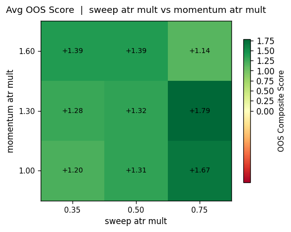
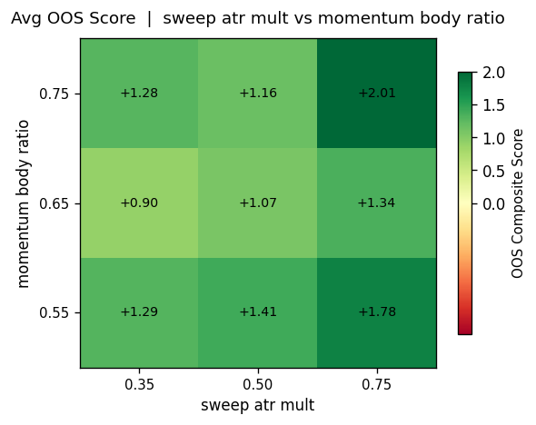
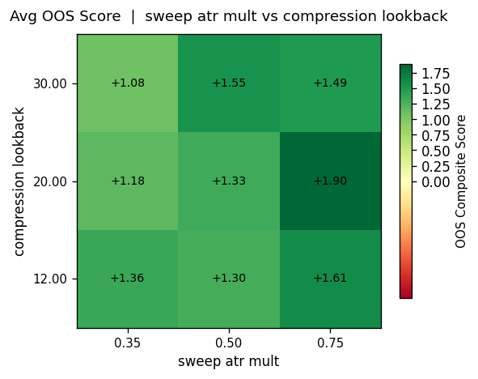
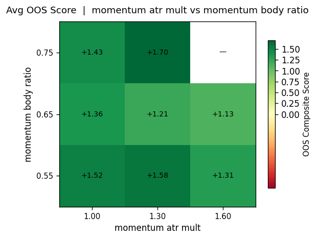
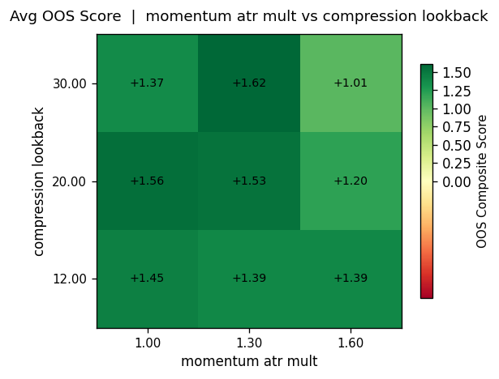
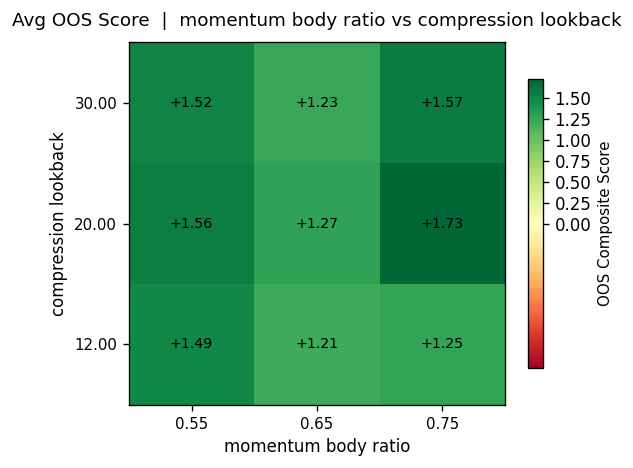
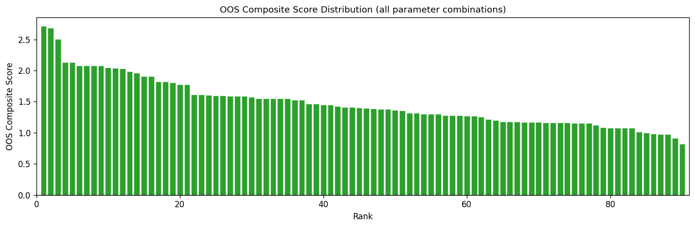
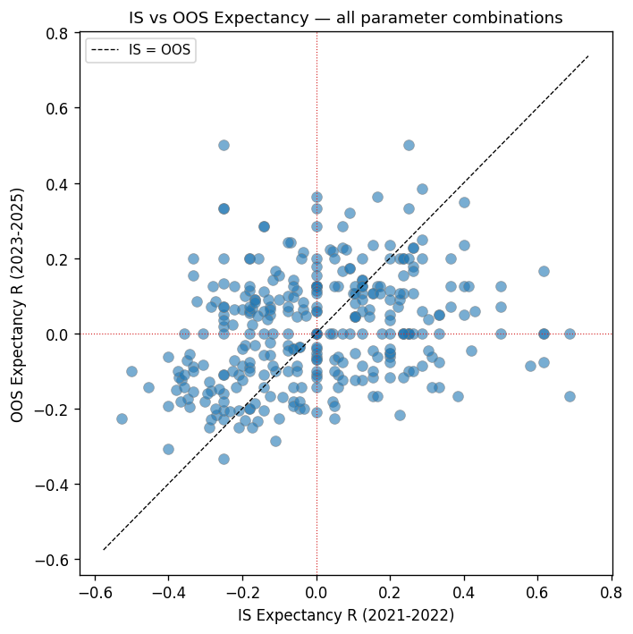

# VCLSMB Parameter Grid Search Report

**Generated:** 2026-03-11 23:59 UTC
**Strategy:** VolatilityContraction → LiquiditySweep → MomentumBreakout (VCLSMB)
**Trend Filter:** Disabled
**Volatility Regime Filter:** Enabled — ATR percentile > 40.0% over 20 days (1h ATR)

## Methodology

- **IS period (In-Sample):**  2021-01-01 – 2022-12-31  (2 years, model development)
- **OOS period (Out-of-Sample):** 2023-01-01 – 2025-12-31 (3 years, robustness validation)
- **Data:** 5-min bars, USATECHIDXUSD

### Parameter Grid

| Parameter | Values |
|-----------|--------|
| `sweep_atr_mult` | [0.35, 0.5, 0.75] |
| `momentum_atr_mult` | [1.0, 1.3, 1.6] |
| `momentum_body_ratio` | [0.55, 0.65, 0.75] |
| `compression_lookback` | [12, 20, 30] |

**Total combinations:** 81  (IS + OOS = 162 backtests)

### Composite Score Formula

```
score = 1.0 × profit_factor
      + 3.0 × expectancy_R
      - 0.5 × (max_dd_R / 10.0)
      + 0.5 × (min(trades, 100) / 100) ^ 0.75

Hard filters: trades ≥ 40, E(R) > 0, max_dd_R < 30
```

---

## Overall Results

- **Total combinations tested:** 81
- **Viable OOS (pass hard filters):** 71 (88%)
- **Best OOS score:** 2.411
  - `sweep_atr_mult` = 0.35
  - `momentum_atr_mult` = 1.30
  - `momentum_body_ratio` = 0.55
  - `compression_lookback` = 12
  - OOS E(R) = +0.286
  - OOS win rate = 42.9%
  - OOS profit factor = 1.50
  - OOS trades = 63
  - OOS max DD = 6.0R

---

## Top 15 Candidates (by OOS Composite Score)

| Rank | sweep | mom_atr | body | comp_lb | IS_E(R) | OOS_E(R) | IS_PF | OOS_PF | IS_n | OOS_n | OOS_DD | OOS_score |
|------|-------|---------|------|---------|---------|----------|-------|--------|------|-------|--------|-----------|
| 1 | 0.35 | 1.30 | 0.55 | 12 | -0.377 | +0.286 | 0.52 | 1.50 | 53 | 63 | 6.0 | 2.411 |
| 2 | 0.35 | 1.30 | 0.55 | 20 | -0.289 | +0.272 | 0.62 | 1.47 | 76 | 92 | 8.0 | 2.356 |
| 3 | 0.35 | 1.60 | 0.55 | 12 | -0.029 | +0.269 | 0.96 | 1.47 | 34 | 52 | 5.0 | 2.330 |
| 4 | 0.75 | 1.30 | 0.75 | 30 | -0.526 | +0.258 | 0.38 | 1.44 | 38 | 62 | 6.0 | 2.268 |
| 5 | 0.35 | 1.30 | 0.75 | 12 | -0.231 | +0.286 | 0.69 | 1.50 | 39 | 56 | 9.0 | 2.231 |
| 6 | 0.35 | 1.30 | 0.65 | 20 | -0.239 | +0.247 | 0.68 | 1.42 | 71 | 89 | 8.0 | 2.223 |
| 7 | 0.50 | 1.30 | 0.55 | 12 | -0.353 | +0.271 | 0.55 | 1.47 | 51 | 59 | 8.0 | 2.221 |
| 8 | 0.35 | 1.30 | 0.65 | 12 | -0.327 | +0.250 | 0.58 | 1.43 | 49 | 60 | 6.0 | 2.219 |
| 9 | 0.35 | 1.30 | 0.75 | 20 | -0.143 | +0.250 | 0.80 | 1.43 | 56 | 84 | 8.0 | 2.217 |
| 10 | 0.75 | 1.00 | 0.55 | 30 | -0.565 | +0.250 | 0.34 | 1.43 | 62 | 84 | 8.0 | 2.217 |
| 11 | 0.75 | 1.30 | 0.55 | 12 | -0.471 | +0.269 | 0.43 | 1.47 | 34 | 52 | 8.0 | 2.180 |
| 12 | 0.75 | 1.30 | 0.65 | 12 | -0.419 | +0.260 | 0.48 | 1.45 | 31 | 50 | 7.0 | 2.176 |
| 13 | 0.75 | 1.00 | 0.55 | 12 | -0.512 | +0.258 | 0.39 | 1.44 | 43 | 62 | 8.0 | 2.168 |
| 14 | 0.75 | 1.30 | 0.75 | 20 | -0.400 | +0.232 | 0.50 | 1.39 | 30 | 56 | 5.0 | 2.164 |
| 15 | 0.35 | 1.60 | 0.65 | 12 | +0.000 | +0.235 | 1.00 | 1.40 | 33 | 51 | 5.0 | 2.158 |

---

## IS vs OOS Robustness

The IS period (2021-2022) includes a significant bear market, so IS metrics
tend to be weak for most configurations. OOS (2023-2025) is the primary
evaluation criterion.

### OOS Expectancy Distribution

| Bucket | Count |
|--------|-------|
| E(R) > +0.1 | 51 |
| E(R) 0.0 – 0.1 | 21 |
| E(R) -0.1 – 0.0 | 9 |
| E(R) < -0.1 | 0 |

---

## Visualisations










---

## Recommended Configuration

Based on the grid search, the recommended parameter set is:

```python
VCLSMBConfig(
    sweep_atr_mult       = 0.35,
    momentum_atr_mult    = 1.30,
    momentum_body_ratio  = 0.55,
    compression_lookback = 12,
    # Fixed params
    atr_period           = 14,
    risk_reward          = 2.0,
)
```

> **Caution:** these parameters were selected from a grid search on historical data.
> Always validate with walk-forward testing before live deployment.

---
*End of report — generated by `research/run_grid_search.py`*